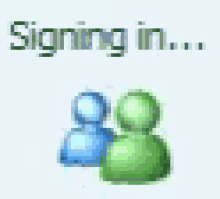
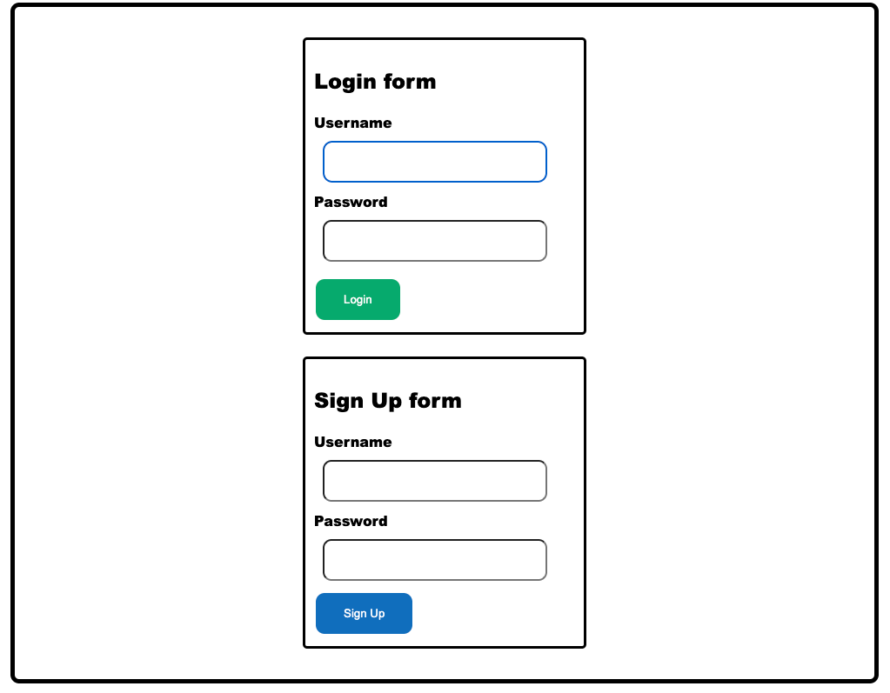
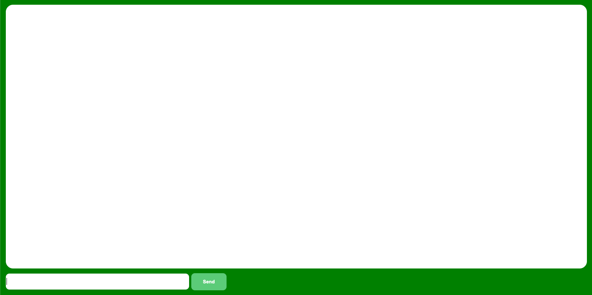

# chat-go

## Simple chat with golang

[](https://github.com/guil95/chat-go/actions/workflows/go.yml)
[](https://github.com/guil95/chat-go/actions/workflows/go.yml)



## Usage

Up dependencies
```shell
$ docker-compose up --build -d
```

Start service
```shell
$ go run cmd/main.go
```

For you see the chats and users collections access localhost:27017 and select app_mongo_db schema

On your browser access the link `http://localhost:8081/login`

You'll see this page (sorry front-end is not my best hehe)


On your first access you'll need create a new account, for this use the sign up form.

After you submit form you'll something like this (again sorry front-end is not my best hehe):


